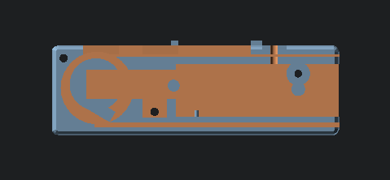
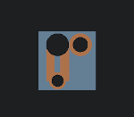
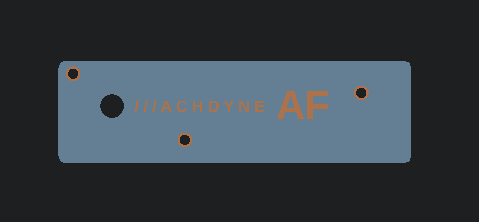
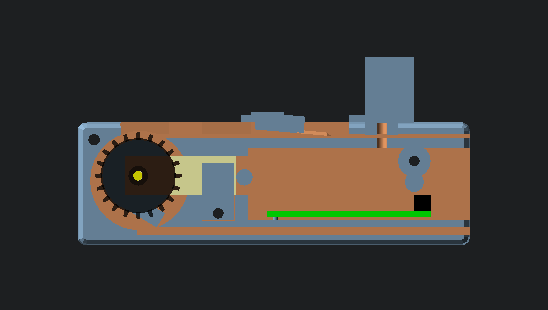
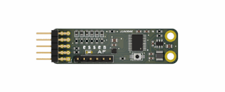
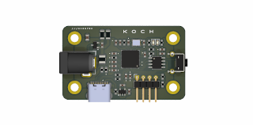

# Machdyne AF

## Overview

Machdyne AF is an open-source project for a PNP autofeeder system[^1].

The autofeeder design is a closed-loop system that uses an infrared LED and phototransistor array[^2] to precisely detect the tape position. The tape is moved forward using a geared DC motor and a sprocket. The cover tape is partially separated and advanced with the tape.

The autofeeders can be chained together with 4 wires and communicate with the system controller using the I2C protocol.

The system uses two custom printed circuit board designs. An autofeeder controller PCB (Essen) includes the tape detection and motor driver circuitry for each autofeeder. A system controller PCB (Koch) provides power and allows a chain of feeders to communicate with the OpenPnP software over a USB-C port.

[^1] This project is still under development and is not yet suitable for use in production.
[^2] While the PCB has an array of six phototransistors, the firmware is currently using only one.

## Autofeeder 3D parts (AF1)

| Model | Image | Description |
| ----- | ----- | ----------- |
| [af](3d/stl/af.stl) |  | The autofeeder body guides the tape and holds the Essen PCB in place |
| [af_sprocket](3d/stl/sprocket.stl) |  | The sprocket advances the tape |
| [af_motor_lock](3d/stl/af_motor_lock.stl) |  | The motor lock holds the motor in place |
| [af_blade](3d/stl/af_blade.stl) |  | The blade partially peels the clear film from the top of the tape to the side |
| [af_led_block](3d/stl/af_led_block.stl) |  | The LED block holds the LED in place |
| [af_lid](3d/stl/af_lid.stl) |  | The lid closes the autofeeder and guides the tape |

### Bill of Materials

| Part | Quantity | Description | Example P/N |
| ---- | -------- | ----------- | ----------- |
| Worm gear motor | 1 | Right-angle N20 DC 12V 16 RPM | JGY-N20 |
| LED | 1 | 3mm 940nm 1.3Vf Infrared LED | DY-FIR204C |
| M3 bolt 12mm + nut | 1 | for blade | - |
| M3 screw 20mm countersunk | 1 | for LED block | - |
| M3 bolt 20mm countersunk + nut | 3 | for lid | - |
| M3 bolt 25mm | 1 | to connect LED block to rail |
| M3 T3 nut | 1 | to connect LED block to rail |

You will also need dupont jumper wires to connect the motor and LED to Essen.

### Assembly Instructions

Cut, strip and solder one end of the jumper wires to the motor leads and each lead of the LED. Press the LED into the LED block, and run the wires through the large LED block hole.

Attach the blade using an M3 bolt and nut.

Press the sprocket onto the motor axle. Press the motor into the motor cavity.

Run the LED wires through the rear autofeeder hole and connect to Essen LED\_A and LED\_K. Connect the motor wires to Essen MOT1 and MOT2.

Push the PCB onto the PCB notches so that it locks into place.

Attach the LED block using the screw.

Place the motor lock on top of the motor.

Attach the lid.

Connect Essen to Koch or other Essens using a 4-pin female-female 2.54mm dupont cable.

Attach the LED block to a 2020 rail with an M3 bolt and T-nut.

The assembled autofeeder (without lid):



## Autofeeder controller PCB (Essen)

Also see the [firmware and usage instructions](fw/essen).



### Pinout (Rear)

```
9  7  5  3  1
10 8  6  4  2
```

| Pin | Signal | Notes |
| --- | ------ | ----- |
| 9/10 | 12V | System power input |
| 7/8 | GND | Ground |
| 5/6 | SDA | I2C data |
| 3/4 | SCL | I2C clock |
| 2 | TRIGGER | Optional external tape advance signal |
| 1 | SWDIO | MCU SWD signal for firmware updates / serial debugging output |

### Pinout (Top)

| Pin | Signal | Notes |
| --- | ------ | ----- |
| 1 | MOT1 | Motor driver output #1 |
| 2 | GND | Ground |
| 3 | MOT2 | Motor driver output #2 |
| 4 | GND | Ground |
| 5 | ELED\_A | External (IR) LED anode |
| 6 | ELED\_K | External (IR) LED cathode |

The motor driver can drive one bidirectional motor or two unidirectional motors.

## System controller PCB (Koch)

Also see the [firmware and usage instructions](fw/koch).



### Pinout

```
1 2 3 4
```

| Pin | Signal | Notes |
| --- | ------ | ----- |
| 1 | 12V | System power output (2.5mm positive tip) |
| 2 | GND | System ground |
| 3 | SDA | I2C data |
| 4 | SCL | I2C clock |

## Funding

This project is being partially funded through the [NGI0 Entrust Fund](https://nlnet.nl/entrust/), a fund established by NLnet with financial support from the European Commission's Next Generation Internet programme.

## License

This project is released under the [CERN-OHL-P](LICENSE.txt) license.
